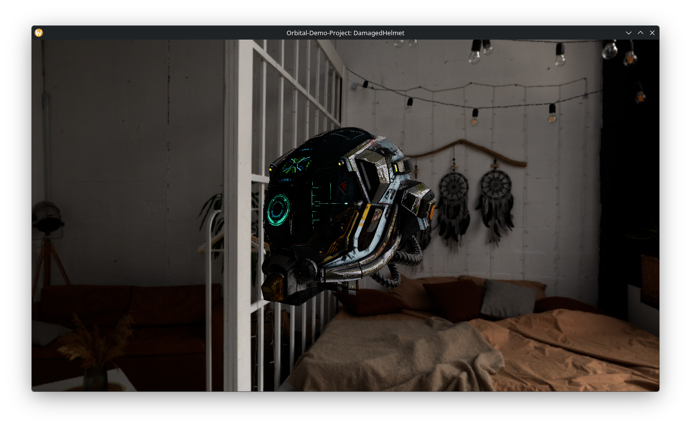
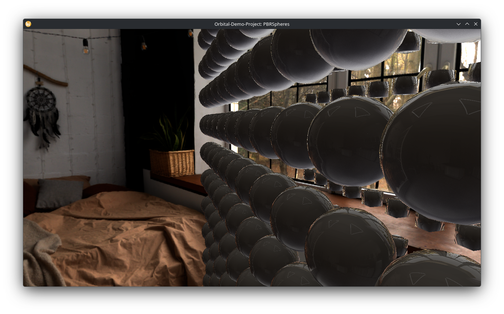
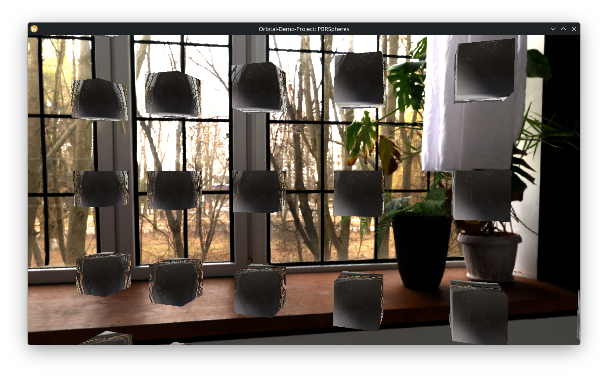

<div align="center">


# 🛰️ Orbital Engine & Framework


_Orbital_ is a cross-platform real-time graphical rendering engine & framework written in Rust.
The goal of this project is to bridge well established industry-standard techniques with upcoming (next-gen) and experimental techniques to form a robust new foundation for next-gen visual computing.

</div>

## Showcase

| glTF demo: Damaged Helmet| |
| - | - |
|  | |
| PBR Grid: Spheres | PBR Grid: Cubes |
|  |  |

## Core Features 

<div align="center">

| Feature | Description |
|--------|-------------|
| **PBR Rendering** | Physically Based Rendering with realistic material properties and lighting |
| **Image-Based Lighting** | Advanced lighting using HDR environment maps for realistic reflections |
| **GLTF 2.0 Support** | Full import capabilities for complex 3D scenes, materials, and animations |
| **Cross-Platform** | Unified rendering across desktop platforms via WGPU abstraction |
| **Modular Architecture** | Flexible element system with message-based communication |
| **Modern Shaders** | WGSL-based shaders for cross-platform compatibility |

</div>

## Experiments

<div align="center">

| Experimental Concept | Description |
| - | - |
| HJAA (Halton-Jitter Anti-Aliasing) | Advanced spatial smoothing utilizing the [Halton Sequence](https://en.wikipedia.org/wiki/Halton_sequence) |
| IVXGI (Incremental Voxel-based Global Illumination) | A evolution of [Nvidia's VXGI](https://developer.download.nvidia.com/assets/events/GDC15/GEFORCE/VXGI_Dynamic_Global_Illumination_GDC15.pdf) for high performance dynamic lighting. |

</div>

> [!IMPORTANT]
> Documentation for experimental features will be released once they have been fully validated in practical, non-theoretical environments.

## Platform Compatibility

- ✅ **Windows**: Full support
- ✅ **Linux**: Full support
- ✅ **macOS**: Full support
- ⚠️ **Web**: Theoretically possible but not currently supported
- ⚠️ **Android**: Works but requires frequent updates to keep compatible
- ❓ **iOS**: Should work similarly to Android but cannot be verified

## Getting Started

To explore the capabilities of the Orbital Engine, check out the examples in the `Examples/` directory. These examples demonstrate various features of the engine including:

- **GLTF PBR Damaged Helmet**: Example showcasing PBR rendering with a damaged helmet model
- **Instancing**: Example demonstrating instanced rendering
- **PBR Grid**: Example showing the PBR material system
- **Roll Camera**: Example with camera controls
- **Skybox**: Example showing environment mapping

To run an example, use:

```shell
cargo run --bin <example_name>
```

To use the engine in your own project, add the following to your `Cargo.toml`:

```toml
orbital = { path = "./Runtime" }
```

## Engine Concepts

### Elements

The primary way to add interactive objects to your world is through **Elements**. Elements are the core game objects that exist in the world and handle their own behavior. Each element can register itself with the world to define what resources it needs (models, cameras, etc.), and can respond to various events during the application lifecycle such as updates and messages from other elements.

### Messaging System

Elements communicate with each other and the world through a message-passing system rather than shared memory. This ensures loose coupling between elements and enables flexible, modular game design. Rather than sharing memory or directly accessing other elements, elements send messages to communicate. This approach is easily scalable - tags can be used multiple times, so messages will be automatically sent to all elements with a matching tag.

### World Architecture

The world manages resource stores (models, cameras, environments, lights), handles the asset import system, and creates the global bind group used by shaders. Resources follow a specific lifecycle involving creation, realization, caching, and cleanup.

## History

The Orbital engine has a rich history spanning multiple iterations and rewrites. The project originally started as "Akimo" and was written in Java as a pure CPU renderer for 2D graphics. Over the years, it evolved through multiple iterations:

- **Akimo (Java)**: Started as a CPU-based 2D renderer, then upgraded to use LWJGL for OpenGL and Vulkan support
- **Akimo (C++)**: A complete rewrite in C++ with Vulkan bindings, still under the "Akimo" name
- **Orbital (Rust/Vulkan)**: A rewrite in Rust but still using Vulkan bindings
- **Orbital (Rust/WGPU/WGSL)**: The current iteration using Rust with WGPU and WGSL, moving away from GLSL to a more modern shader language

Each version learned from the previous ones, with the current implementation built in Rust leveraging the WGPU graphics API abstraction layer for cross-platform support.

## License

This project is dual licensed in Rust's fashion:

- [MIT License](https://spdx.org/licenses/MIT.html)
- [Apache License 2.0](https://spdx.org/licenses/Apache-2.0.html)

For your own project you can chose whichever fits you better.
For templates/examples we recommend to also dual-licensing.

> We highly encourage everyone to share their sub-crates with the community so that others can benefit from it too!

[Orbital]: https://github.com/SakulFlee/Orbital
[WGPU]: https://wgpu.rs/
